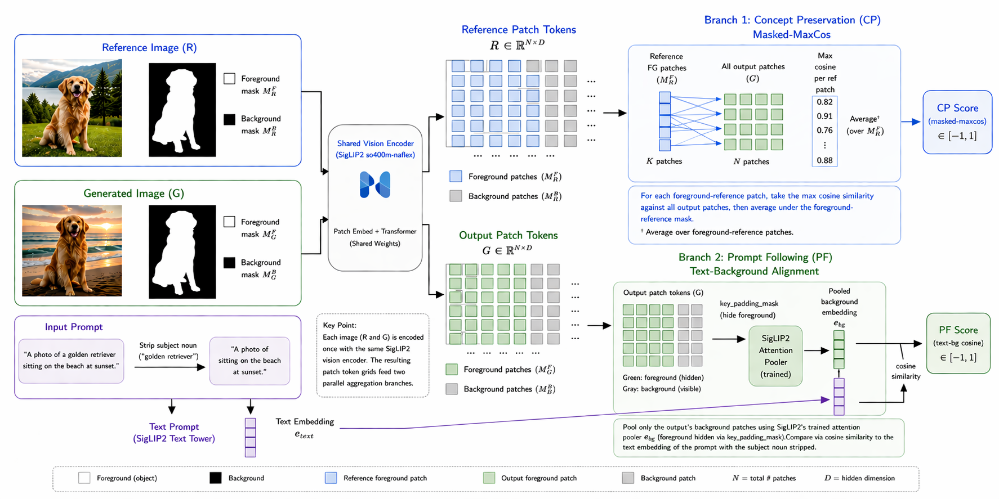

# MaSC — Reproduction Repository

[**Paper**](https://arxiv.org/abs/2605.22469) ·
[**Project page**](https://masc-metric.github.io/) ·
[**Package**](https://github.com/masc-metric/masc) ·
[**PyPI**](https://pypi.org/project/masc-metric/)

Reproduction code for *MaSC: A Masked Similarity Metric for Evaluating
Concept-Driven Generation* (NeurIPS 2026, Evaluations & Datasets Track).
Contains the released [`masc`](src/masc/) Python package plus everything
needed to reproduce every numbered table and figure end-to-end from raw data.



MaSC is a non-LLM evaluation metric for single-concept text-to-image
personalization. One forward pass of `google/siglip2-so400m-patch16-naflex`
per image plus pre-computed segmentation masks yields **two scores**
from the same patch-token tensor:

- **Concept Preservation (CP)** — masked-maxcos over the foreground
  concept region.
- **Prompt Following (PF)** — cosine between a subject-stripped prompt
  embedding and a background-pooled image embedding.

The repo is deliberately self-contained: **no external API calls, no
paid services**. Every comparator either runs on a single GPU or pulls
its rating from data shipped with DreamBench++.

## Setup

```bash
pip install -e ".[repro]"
pip install "torch>=2.6" torchvision --index-url https://download.pytorch.org/whl/cu128
```

Three of the comparators (VQAScore, ImageReward, HPSv3) pin older
versions of `transformers` / `torch`. Install them in a separate venv:

```bash
python -m venv .venv-pf-baselines
source .venv-pf-baselines/bin/activate
pip install "torch==2.5.1" "torchvision==0.20.1" --index-url https://download.pytorch.org/whl/cu124
pip install "transformers==4.45.2" "diffusers==0.31.0"
pip install t2v-metrics imageio-ffmpeg image-reward hpsv3
deactivate
```

Then add a `.env` at the repo root with a HuggingFace token that has
manual-gate access to `google/siglip2-so400m-patch16-naflex`,
`facebook/sam3`, and `facebook/dinov3-*`:

```
HF_TOKEN=hf_...
```

## Datasets

- **DreamBench++** → `data/dreambench_plus/`
  https://github.com/yuangpeng/dreambench_plus
- **ORIDa (train split)** → `data/ORIDa/ORIDa_v1.0/`
  https://arxiv.org/abs/2506.08964 (ships its own segmentation masks;
  no SAM3 step needed.)

## Reproducing the paper

Each section below reproduces one paper table. Every script writes
JSONL rows under `results/` and is **resumable** — re-running skips
already-scored `(concept_id, prompt_id, gen_method, seed)` tuples.

### 0. Generate masks (DreamBench++ only)

```bash
python scripts/generate_masks.py --config configs/masks/sam3_dreambenchplus_refs.yaml
for m in dreambooth_sd dreambooth_lora_sdxl textual_inversion_sd \
         blip_diffusion emu2 \
         ip_adapter_plus_vit_h_sdxl ip_adapter_vit_g_sdxl; do
  python scripts/generate_masks.py \
    --config configs/masks/sam3_dreambenchplus_samples.yaml --method $m
done
```

Masks land under `data/masks/dreambench_plus/{refs,samples/<method>/}/`.
~3-4 hours on an RTX 3090.

### 1. Table 1 — Concept Preservation on DreamBench++

```bash
DBPP=(dreambooth_sd dreambooth_lora_sdxl textual_inversion_sd
      blip_diffusion emu2
      ip_adapter_plus_vit_h_sdxl ip_adapter_vit_g_sdxl)

for cfg in \
  siglip2_so400m_naflex_dreambenchplus_maskedmaxcos \
  siglip2_global_so400m_naflex_dreambenchplus \
  dreamsim_dreambenchplus \
  dinov3_dbplus_dreambenchplus \
  radio_summary_dreambenchplus \
  dift_canonical_dreambenchplus; do
  for m in "${DBPP[@]}"; do
    python scripts/compute_geometry.py \
      --config configs/geometry/${cfg}.yaml --method $m
  done
done

python scripts/plot_dreambenchplus_cp.py
```

Expected pooled α (paper rows; reviewer reproductions land within ±0.005):

| Row | Paper α | Source |
| --- | ---: | --- |
| Human inter-rater (ceiling) | +0.658 | DB++ shipped ratings |
| GPT-4o | +0.499 | DB++ shipped (`data_gpt_rating/`) |
| **MaSC** | **+0.471** | `siglip2_so400m_naflex_dreambenchplus_maskedmaxcos.yaml` |
| GPT-4V | +0.432 | DB++ shipped |
| DreamSim | +0.421 | `dreamsim_dreambenchplus.yaml` |
| SigLIP2 SO400M-NaFlex global pool | +0.369 | `siglip2_global_so400m_naflex_dreambenchplus.yaml` |
| DINOv3 ViT-L/16 CLS cosine | +0.345 | `dinov3_dbplus_dreambenchplus.yaml` |
| DIFT-SDXL canonical | +0.324 | `dift_canonical_dreambenchplus.yaml` |
| DINO-I | +0.311 | DB++ shipped (`data_dino_rating/`) |
| AM-RADIO C-RADIOv4-SO400M | +0.226 | `radio_summary_dreambenchplus.yaml` |
| CLIP-I | +0.135 | DB++ shipped (`data_clip_rating/`) |

DB++-shipped baselines (DINO-I, CLIP-I, GPT-4o, GPT-4V) are static JSON
files distributed with the dataset; no compute step.

**Independent α-formula validator** (reproduces DB++'s Table 3 H-H/G-H/D-H/C-H within ±0.02):

```bash
python scripts/reproduce_dbplus_kdo.py
```

### 2. Table 2 — Concept Preservation on ORIDa

```bash
for cfg in \
  siglip2_so400m_naflex_orida_50x10 \
  siglip2_global_so400m_naflex_orida_50x10 \
  dreamsim_orida_50x10 \
  dinov3_dbplus_orida_50x10 \
  radio_summary_orida_50x10 \
  dinoi_dbplus_orida_50x10 \
  clipi_dbplus_orida_50x10 \
  dift_canonical_orida_50x10; do
  python scripts/compute_geometry.py --config configs/geometry/${cfg}.yaml
done

python scripts/plot_orida_cp.py
```

Expected AUC(within > cross):

| Metric | Paper AUC |
| --- | ---: |
| **MaSC** | **0.992** |
| AM-RADIO C-RADIOv4-SO400M | 0.961 |
| SigLIP2 SO400M-NaFlex global pool | 0.954 |
| DINOv3 ViT-L/16 CLS cosine | 0.942 |
| DreamSim | 0.873 |
| DINO-I | 0.848 |
| DIFT-SDXL canonical | 0.834 |
| CLIP-I | 0.800 |

Renders Figure 2 (`report/figures/orida_cp_violins.{png,pdf}`).

### 3. Table 3 — Prompt Following on DreamBench++

```bash
DBPP=(dreambooth_sd dreambooth_lora_sdxl textual_inversion_sd
      blip_diffusion emu2
      ip_adapter_plus_vit_h_sdxl ip_adapter_vit_g_sdxl)

# MaSC PF + SigLIP2 global pool baseline (main venv)
for cfg in siglip2t_so400m_naflex_global_bg_nosubj_dreambenchplus \
           siglip2t_so400m_naflex_dreambenchplus; do
  for m in "${DBPP[@]}"; do
    python scripts/compute_prompt_following.py \
      --config configs/prompt_following/${cfg}.yaml --method $m
  done
done

# External PF baselines (separate venv with pinned transformers/torch)
source .venv-pf-baselines/bin/activate
for cfg in vqascore_dreambenchplus imagereward_dreambenchplus hpsv3_dreambenchplus; do
  for m in "${DBPP[@]}"; do
    python scripts/compute_prompt_following_external.py \
      --config configs/prompt_following/${cfg}.yaml --method $m
  done
done
deactivate

python scripts/compute_new_pf_baselines.py
```

Expected pooled α:

| Scorer | Paper α |
| --- | ---: |
| Human inter-rater (ceiling) | +0.563 |
| GPT-4o | +0.547 |
| VQAScore | +0.504 |
| GPT-4V | +0.485 |
| ImageReward | +0.441 |
| **MaSC** | **+0.354** |
| CLIP-T | +0.327 |
| SigLIP2 SO400M-NaFlex global pool | +0.326 |
| HPSv3 | +0.299 |

CLIP-T, GPT-4o PF, GPT-4V PF come from DB++ shipped data.

### 4. Table 4 — PF subject-strip × pool ablation

```bash
# Three additional pool variants on top of the MaSC + global pool runs above
for cfg in siglip2t_so400m_naflex_global_bg_dreambenchplus \
           siglip2t_so400m_naflex_global_nosubj_dreambenchplus \
           siglip2t_so400m_naflex_global_fg_dreambenchplus; do
  for m in "${DBPP[@]}"; do
    python scripts/compute_prompt_following.py \
      --config configs/prompt_following/${cfg}.yaml --method $m
  done
done

python scripts/compare_nosubj_ablation.py
```

Expected pooled α grid:

| pool \ prompt | full | subject-stripped |
| --- | ---: | ---: |
| BG-pool (**MaSC**) | +0.344 | **+0.354** |
| Full pool (no mask) | +0.326 | +0.348 |
| FG-pool (inverse control) | −0.108 | — |

### 5. Section 4.4 — "Aggregator dominates features"

The `recall_fg` aggregator on the same patch features as MaSC's
`masked_maxcos`. Each JSONL stores all four score variants in `extras`,
so the masked-maxcos variant is computed in the same forward pass.

```bash
for cfg in siglip2_dreambenchplus dinov3_dreambenchplus; do
  for m in "${DBPP[@]}"; do
    python scripts/compute_geometry.py \
      --config configs/geometry/${cfg}.yaml --method $m
  done
done

# Specialized matchers under masked-maxcos (paper claims all four
# land α-negative on DB++).
for cfg in lightglue_dreambenchplus \
           loftr_dreambenchplus_maskedmaxcos \
           roma_dreambenchplus_maskedmaxcos \
           mast3r_dreambenchplus_maskedmaxcos; do
  for m in "${DBPP[@]}"; do
    python scripts/compute_geometry.py \
      --config configs/geometry/${cfg}.yaml --method $m
  done
done

python scripts/plot_dreambenchplus_cp.py   # full table now includes these rows
```

Paper claim Δα(masked − recall): **+0.462** on SigLIP2 patch features,
**+0.716** on DINOv3 patch features.

### 6. Mask-source robustness (CP and PF)

Holds MaSC's matcher fixed (SigLIP2-so400m-naflex masked-maxcos for CP,
SigLIP2-so400m-naflex BG-pool subject-stripped for PF) and swaps the
upstream segmenter for CLIPSeg, Grounded-SAM2, and OWLv2+SAM2. Each
segmenter's masks pass through the same 5% min-fg-fraction filter, so
each row sees a different surviving subset; α and ρ are reported on
the intersection of keys present under every segmenter for an
apples-to-apples comparison.

```bash
DBPP=(dreambooth_sd dreambooth_lora_sdxl textual_inversion_sd
      blip_diffusion emu2
      ip_adapter_plus_vit_h_sdxl ip_adapter_vit_g_sdxl)

# Generate ref + sample masks for each alternative segmenter.
for src in clipseg grounded_sam2 owlv2_sam2; do
  python scripts/generate_masks.py --config configs/masks/${src}_dreambenchplus_refs.yaml
  for m in "${DBPP[@]}"; do
    python scripts/generate_masks.py \
      --config configs/masks/${src}_dreambenchplus_samples.yaml --method $m
  done
done

# CP runs (one per alt segmenter × method).
for src in clipseg grounded_sam2 owlv2_sam2; do
  for m in "${DBPP[@]}"; do
    python scripts/compute_geometry.py \
      --config configs/geometry/siglip2_so400m_naflex_dreambenchplus_maskedmaxcos_masks_${src}.yaml \
      --method $m
  done
done

# PF runs (one per alt segmenter × method).
for src in clipseg grounded_sam2 owlv2_sam2; do
  for m in "${DBPP[@]}"; do
    python scripts/compute_prompt_following.py \
      --config configs/prompt_following/siglip2t_so400m_naflex_global_bg_nosubj_dreambenchplus_masks_${src}.yaml \
      --method $m
  done
done

python scripts/plot_mask_source_robustness.py      # CP table
python scripts/plot_pf_mask_source_robustness.py   # PF table
```

The SAM3 baseline rows reuse the geometry / PF JSONLs from sections 1
and 3 — no extra compute. Tables land at `report/tables/{,pf_}mask_source_robustness.md`.

### 7. Table 5 — Compute and runtime

Per-pair latency on a single fixed DB++ pair, each metric in its own
subprocess with `torch.cuda.synchronize()`. Reported on RTX 3090.

```bash
python scripts/benchmark_speed.py                    # CP-side
source .venv-pf-baselines/bin/activate
python scripts/benchmark_speed_pf_baselines.py       # PF-side
deactivate
```

## Repository layout

```
masc-reproduction/
├── src/masc/                # MaSC package source (the released artifact)
├── tests/                   # pure-Python smoke tests (no GPU)
├── repro_eval/              # reproduction helpers
│   ├── data.py              # DreamBench++ + ORIDa sample builders
│   ├── geometry/            # CP comparators
│   ├── pf/                  # PF comparator scorers
│   └── masks/               # SAM3 text-prompted segmenter
├── scripts/                 # reproduction CLIs (one per stage)
└── configs/                 # one YAML per (matcher, dataset) tuple
```

Every JSONL row has the schema:

```json
{
  "concept_id": "object_00_motorcycle",
  "prompt_id": "0",
  "gen_method": "dreambooth_sd",
  "seed": 0,
  "signal": "geometry",
  "model": "siglip2-so400m",
  "score": 0.731,
  "extras": {"...per-model diagnostics..."}
}
```

## Citation

```bibtex
@article{bartkowiak2026masc,
  title={MaSC: A Masked Similarity Metric for Evaluating Concept-Driven Generation},
  author={Bartkowiak, Patryk and Petersen, Lennart and Kotrys, Bartosz and Michels, Dominik and Pirk, Soren and Palubicki, Wojtek},
  journal={arXiv preprint arXiv:2605.22469},
  year={2026}
}
```

## License

Apache-2.0. See [LICENSE](LICENSE).
